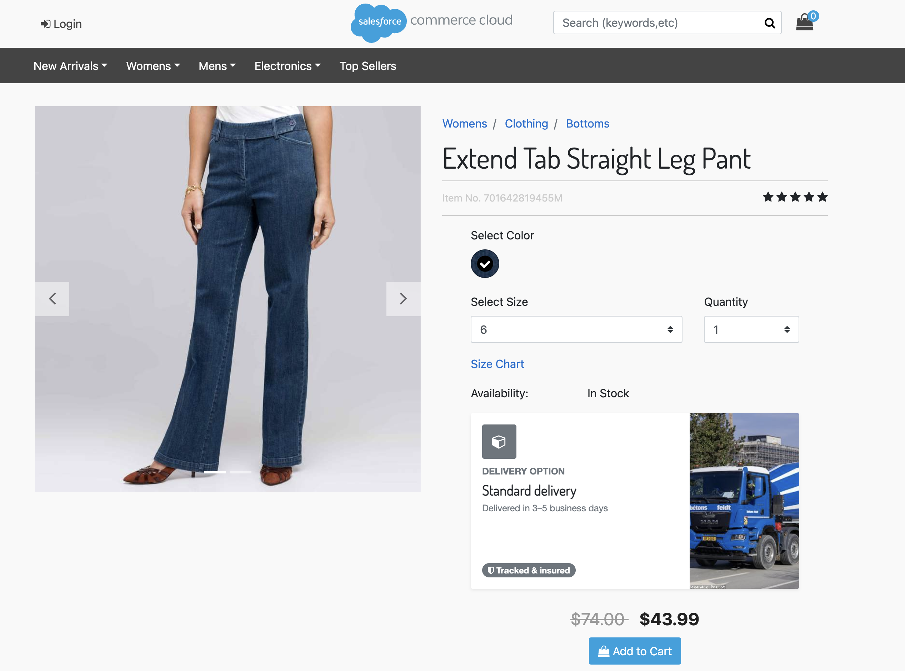
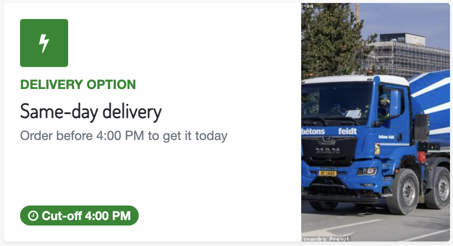
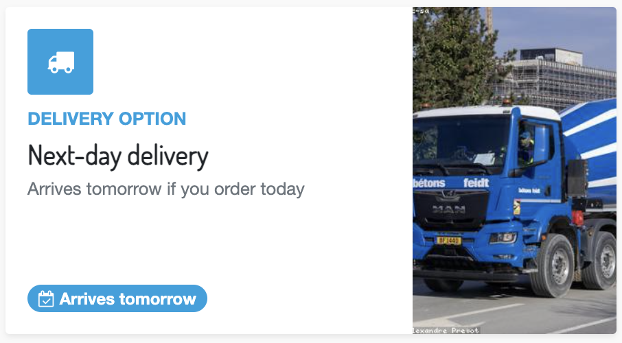
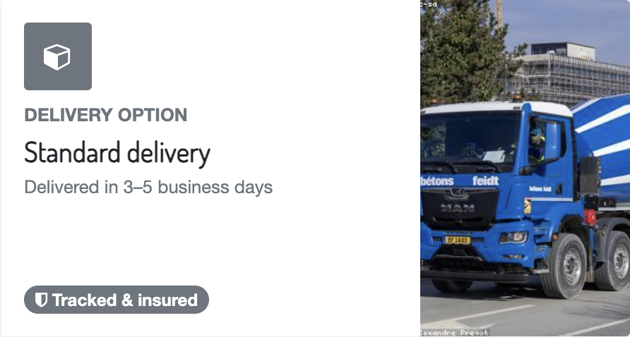

# SFCC Engineer Task

## Background

When a shopper lands on a product page and selects a product which is in stock, below the
availability information, merchandising wants the PDP to display how soon the delivery can be made.

How fast we can deliver a given product to a given country is decided by an external fulfilment
service. The storefront's job is to ask that service on sellable product selection and render the
matching content.

## Requirements

On the PDP, below the existing availability information:

1. If variant availability is In Stock, call the fulfilment service for this product + country.
2. The service returns a delivery tier (`SAME_DAY`, `NEXT_DAY`, `STANDARD`).
3. Render the respective content based on delivery tier response.
4. The content block must be responsive and render in the Montserrat font specifically.
5. The content shown for each tier must be brand-managed without a code deployment.
6. The PDP must always load fast and never break.
7. Documentation must be created with technical details and configurations, and for business on how
   to use them.

**Reference:**


<!-- Replace with the reference screenshot (image-20260930-101117.png from the task page). -->

## The content block

Each delivery tier maps a message to be shown on the PDP. Images can be used as per preference; below
is only a sample reference.

| Tier | Example block |
| --- | --- |
| `SAME_DAY` |  |
| `NEXT_DAY` |  |
| `STANDARD` |  |

## Service contract

The endpoint is protected with **HTTP Basic Authentication**. Send an
`Authorization: Basic <base64(username:password)>` header on every request.

```
GET {{ENDPOINT}}/fulfillment?sku={sku}&country={country}
Authorization: Basic {{base64(username:password)}}
```

Returns a normalized `tier` your content map keys on:

```json
Successful response example with status code 200
{
  "sku": "sku",
  "country": "country",
  "tier": "tier"
}

Error response example with status code 400/401/500
{
  "error": "error_type",
  "message": "error_message"
}
```

**Mocking the service.** No real backend — stand up a mock and note it in the README. Any of these
works:

- **Beeceptor** (`https://<name>.free.beeceptor.com`) or **Mocky** (`https://run.mocky.io/...`),
  varying `tier` per sku so you can demo every block.
- **DummyJSON** (`https://dummyjson.com/...`) if you'd rather map a real live response.
- A stub routed through the Service framework, with a note on how you'd swap in the real URL.

Include one sku with a **3–5s delay or intermittent 500** so you can demonstrate resilience.

## Acceptance criteria

- On available variant selection, the fulfilment service is called for `{sku, country}`; the matching
  tier's content block renders below the availability info.
- Each tier's content (copy, image, styling) is business-editable in BM with no deployment.
- The block is responsive and accessible, with clean loading and fallback states and no layout shift.
- A slow or failing fulfilment service never blocks or breaks the PDP.
- Repeat views of the same variant don't repeatedly hit the service.
- The block renders in Montserrat, loaded without hurting performance.
- The feature flag disables the whole feature cleanly.
- No visual or JS errors.

---

## Environment & submission

- You'll get a **fresh sandbox** with **only the SFRA storefront**.
- **Estimated effort:** ~1 day (roughly 6–10 hours depending on experience).
- **Submit** a **private GitHub repository shared with @faraharif**, containing your code, respective
  documentation, and a `README.md` to document your implementation and how to test it.
